# Sivanandh

**Web / Android Developer**

Building clean, reliable apps for web and Android. Based in Bangalore, India.

[Website](http://ftsivvv.web.app/) · [Email](mailto:sivanandhpp@gmail.com) · [LinkedIn](https://www.linkedin.com/in/sivanandh/) 

## About

I am an aspiring software developer with a diverse team in a well-reputed organization. I focus on programming, fast learning, and reliable problem-solving, and I enjoy turning ideas into usable products.

## Now

- 🚀 Building [one - The all in one app](http://github.com/Sivanandhpp/one)
- 🧠 Mastering Kotlin Android
- 🤝 Open to collaborations in software development
- ⚡ I love coding over food <3

## Highlights

- **one - The all in one app**: a unified, everyday companion app for productivity and essentials.

## GitHub Signals

	
	

## 📅 Commit Calendar

## 🈷️ Languages Activity

Languages which i use across all repositories.

## 🗳️ LeetCode

LeetCode stats from my account.

## Support

